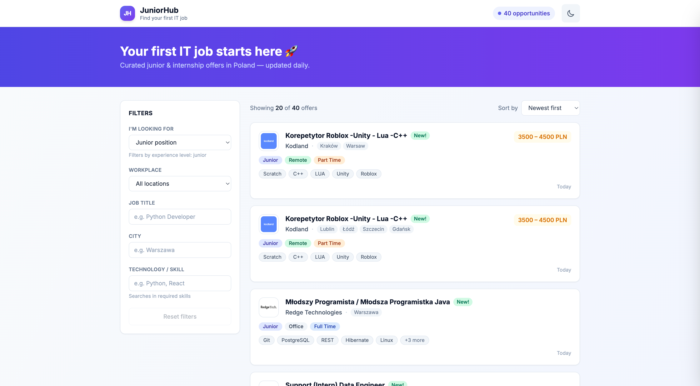
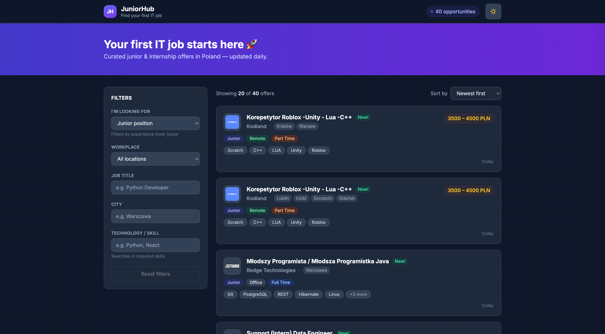
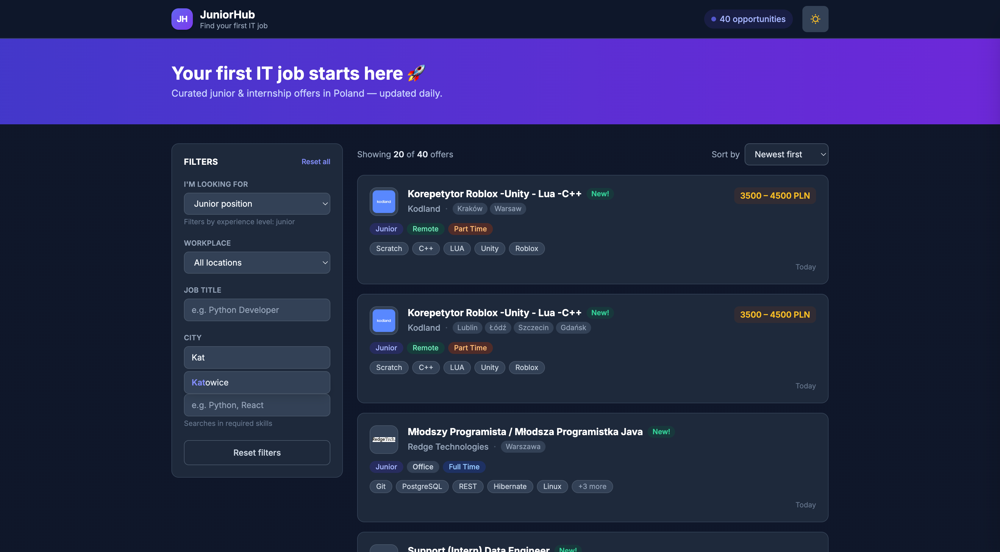
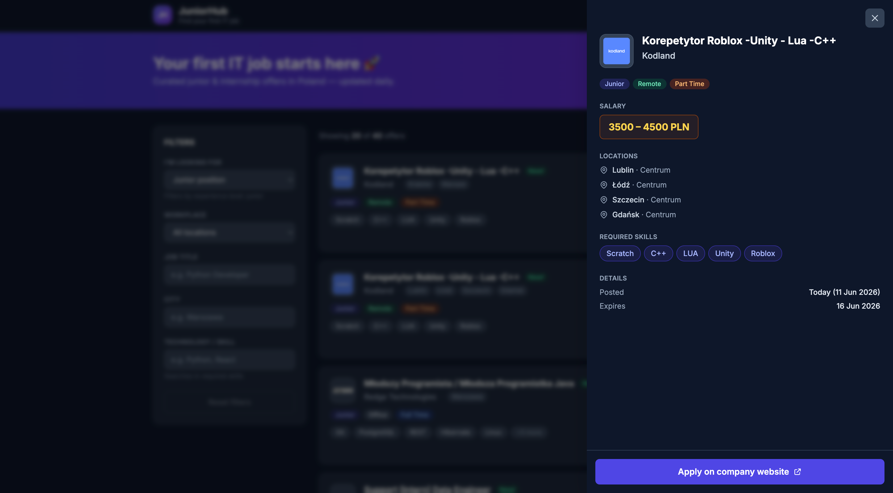
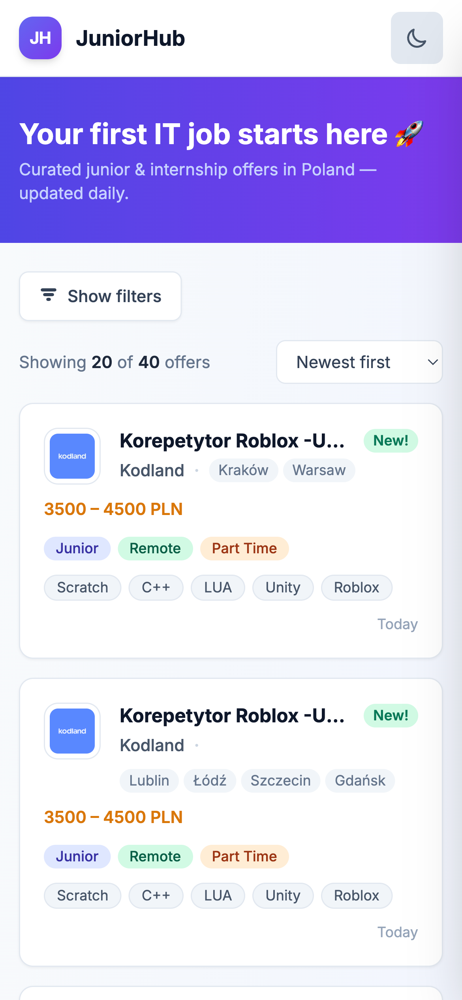
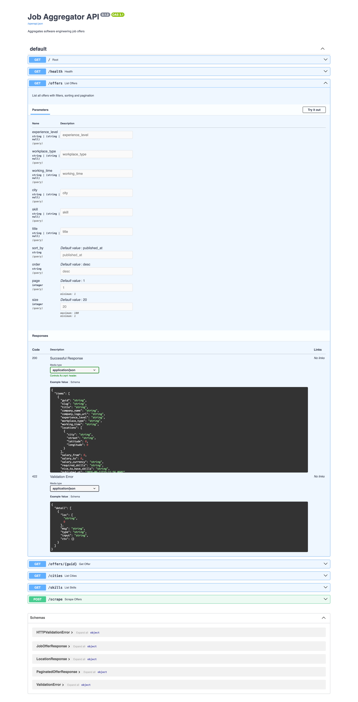

# JuniorHub — Find your first IT job

A full-stack job aggregator built around one idea: **make it easy for juniors and interns to find their first IT job in Poland**.

The app scrapes offers from Polish job boards, normalizes them, and exposes them through a friendly UI focused on entry-level positions only — no senior roles, no noise.

> **🔗 Live demo:** [juniorhub-blush.vercel.app](https://juniorhub-blush.vercel.app) · **API docs:** [juniorhub-api.onrender.com/docs](https://juniorhub-api.onrender.com/docs)
>
> ⚡ First load may take ~30s — the backend runs on Render's free tier and spins down after 15 min of inactivity.

<!-- SCREENSHOT: hero shot of the app — desktop view with offer list, filter panel on the left, gradient hero banner at the top. Best taken in light mode with a few offers visible. -->



---

## Features

### Frontend
- **Filtered offer list** with experience level, workplace, city, skill, and job title
- **Autocomplete** for city and skill inputs — backed by deduplicated values from the database (no `Python`/`python` duplicates, no `Kraków`/`Krakow` duplicates)
- **URL state persistence** — filters survive page refresh and produce shareable links
- **Slide-in drawer** with full offer details fetched on demand
- **Dark mode** with OS preference detection and `localStorage` persistence
- **"New!" badge** on offers from today or yesterday
- **Responsive design** — collapsible filter drawer on mobile, sidebar on desktop
- Loading skeletons, friendly empty states, and error recovery

<!-- SCREENSHOT: dark mode view, ideally side-by-side with light mode in the same composition. Shows off the dark theme palette. -->



<!-- SCREENSHOT: filter panel close-up with the autocomplete dropdown open (e.g. typing "war" and showing "Warszawa" highlighted). -->



<!-- SCREENSHOT: the slide-in drawer open, showing offer details — title, badges, salary, skills, apply button. -->



<!-- SCREENSHOT: mobile view (375px width) — collapsed filters and offer cards stacked vertically. Browser dev tools mobile preview is fine. -->

<p align="center">
  
</p>

### Backend
- **Paginated, filtered API** with sort options
- **Background scheduler** — re-scrapes every 12 hours and purges expired offers
- **Manual scrape trigger** via `POST /scrape`
- **Auto-deduplicated lookup endpoints** for cities and skills (case- and diacritic-insensitive)
- **Interactive API docs** at `/docs` (Swagger UI)

<!-- SCREENSHOT: FastAPI /docs page showing the available endpoints. Optional but nice for a portfolio. -->



---

## Tech stack

| Layer    | Stack                                                                            |
| -------- | -------------------------------------------------------------------------------- |
| Frontend | React 18 · TypeScript (strict) · Vite · Tailwind CSS · plain `fetch`             |
| Backend  | Python 3.12 · FastAPI · SQLAlchemy · APScheduler · httpx                         |
| Database | SQLite (file-based; ready to swap for Postgres via `DATABASE_URL`)                |
| Infra    | Docker · docker-compose · Render (API) · Vercel (frontend)                       |

**Deliberately not used:** React Router, Redux/Zustand/React Query, ORM migrations, message brokers. The goal was to keep the moving parts minimal.

---

## Quick start

### With Docker (backend only)

```bash
git clone https://github.com/michalkaluzny/job-aggregator.git
cd job-aggregator
docker-compose up --build -d
```

Backend is available at `http://localhost:8000`. The first scrape kicks off automatically on startup and again every 12 hours.

### Frontend

```bash
cd frontend
npm install
npm run dev
```

Open `http://localhost:5173` in your browser. The frontend talks to `http://localhost:8000` by default — to point it elsewhere, copy `.env.example` to `.env` and set `VITE_API_URL`.

> The backend's allowed CORS origins default to `http://localhost:5173` and are configurable via the `CORS_ORIGINS` env var (comma-separated).

### Without Docker

```bash
cd backend
python -m venv .venv && source .venv/bin/activate
pip install -r requirements.txt
uvicorn app.main:app --reload
```

The database file and tables are created automatically on first startup — no manual migration step.

### Environment variables

| Variable        | Side     | Default                      | Purpose                                            |
| --------------- | -------- | ---------------------------- | -------------------------------------------------- |
| `DATABASE_URL`  | backend  | `sqlite:///./data/jobs.db`   | SQLAlchemy connection string                        |
| `CORS_ORIGINS`  | backend  | `http://localhost:5173`      | Comma-separated list of allowed frontend origins    |
| `VITE_API_URL`  | frontend | `http://localhost:8000`      | Base URL of the backend API                         |

---

## API reference

The API is self-documenting at `http://localhost:8000/docs` once running.

| Method | Endpoint           | Description                                          |
| ------ | ------------------ | ---------------------------------------------------- |
| `GET`  | `/health`          | Liveness check                                       |
| `GET`  | `/offers`          | Paginated list with filters & sorting                |
| `GET`  | `/offers/{guid}`   | Single offer by GUID                                 |
| `GET`  | `/cities`          | Deduplicated distinct cities                         |
| `GET`  | `/skills`          | Deduplicated distinct skills                         |
| `POST` | `/scrape`          | Run the scraper manually                             |

### `GET /offers` query parameters

| Parameter          | Type   | Example         | Notes                                                  |
| ------------------ | ------ | --------------- | ------------------------------------------------------ |
| `experience_level` | string | `junior`        | `junior` \| `mid` \| `senior`                          |
| `workplace_type`   | string | `remote`        | `remote` \| `hybrid` \| `office`                       |
| `working_time`     | string | `internship`    | `internship` \| `full_time` \| `part_time`             |
| `city`             | string | `Warszawa`      | Case- and diacritic-insensitive matching               |
| `skill`            | string | `Python`        | Case-insensitive substring match in required_skills    |
| `title`            | string | `Python Dev`    | Case-insensitive substring match                       |
| `sort_by`          | string | `published_at`  | Default `published_at`                                 |
| `order`            | string | `desc`          | `asc` \| `desc`                                        |
| `page`             | int    | `1`             | Default `1`                                            |
| `size`             | int    | `20`            | Default `20`, max `100`                                |

---

## Project structure

```
job-aggregator/
├── backend/
│   ├── app/
│   │   ├── database/
│   │   │   ├── db.py             # SQLAlchemy engine + session
│   │   │   ├── init_db.py        # Schema creation
│   │   │   └── repository.py     # DB queries + scheduled cleanup
│   │   ├── models/               # Pydantic + SQLAlchemy models
│   │   ├── scrapers/
│   │   │   └── justjoinit.py     # JustJoinIt scraper
│   │   └── main.py               # FastAPI app, lifespan, scheduler
│   ├── Dockerfile
│   └── requirements.txt
├── frontend/
│   ├── src/
│   │   ├── api/offers.ts         # Typed fetch wrappers
│   │   ├── components/           # OfferCard, FilterPanel, Autocomplete, OfferDrawer, ...
│   │   ├── hooks/                # useOffers, useOfferDetail, useDarkMode, useDebounce
│   │   ├── types/offer.ts        # Shared TypeScript interfaces
│   │   ├── utils/offer.ts        # Formatters, color maps
│   │   └── App.tsx
│   ├── package.json
│   └── tailwind.config.js
└── docker-compose.yml
```

---

## How the scraping works

On startup, FastAPI registers two recurring jobs with APScheduler:

1. **Scrape** — fetches up to 1000 offers from JustJoinIt, deduplicates by `guid`, inserts the new ones.
2. **Cleanup** — removes offers whose `expires_at` has passed.

Both run every 12 hours. The scrape can also be triggered manually:

```bash
curl -X POST http://localhost:8000/scrape
```

---

## Deployment

The live demo runs on free-tier hosting, configured entirely through environment variables:

- **Backend → [Render](https://render.com)** — root directory `backend`, start command `uvicorn app.main:app --host 0.0.0.0 --port $PORT`. `CORS_ORIGINS` is set to the Vercel URL.
- **Frontend → [Vercel](https://vercel.com)** — root directory `frontend`, framework preset Vite, with `VITE_API_URL` pointing at the Render backend.

Both redeploy automatically on every push to `main`.

---

## Roadmap

- [x] Deploy to free-tier hosting (Render + Vercel)
- [ ] Second data source (NoFluffJobs or BulldogJob)
- [ ] Database indexes on `experience_level`, `workplace_type`, `published_at`
- [ ] Migrate from SQLite to Postgres (Neon or Supabase)
- [ ] Fuzzy city matching (`krkw` → `Kraków`)
- [ ] Saved searches & email digests

---

## License

MIT
